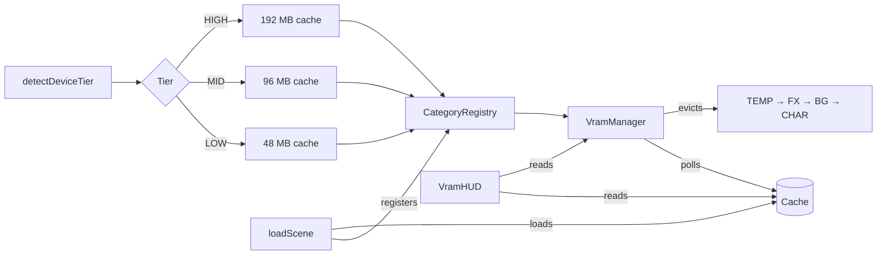
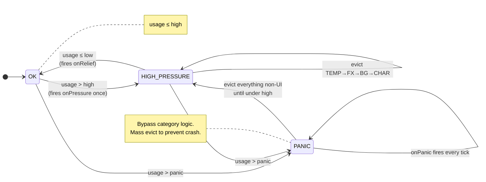
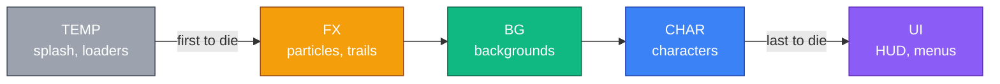
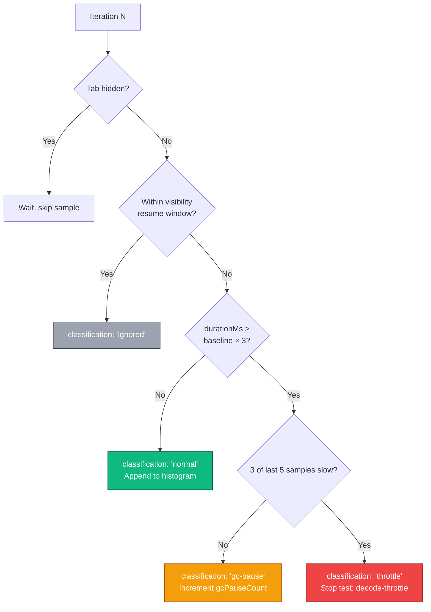

# @zakkster/lite-vram

[](https://www.npmjs.com/package/@zakkster/lite-vram)
[](https://bundlephobia.com/result?p=@zakkster/lite-vram)
[](https://www.npmjs.com/package/@zakkster/lite-vram)
[](https://www.npmjs.com/package/@zakkster/lite-vram)


[](https://opensource.org/licenses/MIT)

Production VRAM management for HTML5 game engines. Device-aware budgets, category-priority eviction, Safari crash prevention, and the data to prove it works on every device.

**The VRAM system that PixiJS, Phaser, Construct, and Cocos don't have.**

**[→ Try the Live Diagnostic Dashboard](https://inquisitive-puppy-ca0290.netlify.app/)**

> **v1.1.0 — "Hysteresis"** ships three bug fixes from analysis of 38 real-device reports.
> See the [changelog](./CHANGELOG.md) for details. Backwards-compatible — no code changes required.

## Why lite-vram?

| Feature | lite-vram | PixiJS | Phaser | Construct | Cocos |
|---|---|---|---|---|---|
| **Device tier detection (GPU + RAM + cores)** | **Yes (7 rules)** | No | No | No | No |
| **Per-tier VRAM budgets (32–256 MB)** | **Yes** | No | No | No | No |
| **Per-tier hysteresis watermarks** | **Yes (v1.1)** | No | No | No | No |
| **Category-priority eviction** | **Yes (TEMP→FX→BG→CHAR→UI)** | No | No | No | No |
| **Safari panic mode (96%+)** | **Yes** | No | No | No | No |
| **Tier-aware texture resolution** | **Yes (@0.5x/@0.75x/1.0x)** | No | No | No | No |
| **Decode throttle detection (rolling window)** | **Yes (v1.1)** | No | No | No | No |
| **GC-pause vs throttle classification** | **Yes (v1.1)** | No | No | No | No |
| **Decode percentile histogram** | **Yes (v1.1)** | No | No | No | No |
| **Device crash matrices (38+)** | **Yes (JSON)** | No | No | No | No |
| **Live diagnostic dashboard** | **Yes (HTML)** | No | No | No | No |
| **Scene streaming pipeline** | **Yes (safe transitions)** | Manual | Manual | N/A | Manual |
| **TypeScript declarations** | **Yes (10 .d.ts)** | Partial | Partial | No | Partial |
| **Zero dependencies** | **Yes** | No | No | N/A | No |

## Installation

```bash
npm install @zakkster/lite-vram
```

## Architecture at a Glance



## Quick Start

```javascript
import {
    createCacheAuto, CategoryRegistry, VramManager,
    AssetResolver, getWatermarksForTier,
    loadScene, transitionScenes, VramHUD
} from '@zakkster/lite-vram';

// 1. Boot — auto-detects device, picks correct budget
const { cache, tier } = createCacheAuto();
const registry = new CategoryRegistry();
const resolver = new AssetResolver({ basePath: 'assets' });

// 2. VramManager — with v1.1 tier-aware watermarks
const manager = new VramManager(cache, {
    registry,
    ...getWatermarksForTier(tier.tier),                // hysteresis preset
    onEvict: (id, cat) => console.log(`Evicted: ${id} [${cat}]`),
    onPanic: (u) => console.error(`PANIC at ${(u*100).toFixed(0)}%`)
});
manager.start();

// 3. Dev HUD (remove in production)
if (import.meta.env?.DEV) {
    new VramHUD(cache, { manager, position: 'top-right' });
}

// 4. Load a scene
const forest = {
    name: 'forest',
    assets: resolver.resolveSceneAssets([
        { id: 'bg-sky',    category: 'bg' },
        { id: 'hero',      category: 'char' },
        { id: 'hud-hp',    category: 'ui' },   // immune to eviction
    ], tier.tier)
};
await loadScene(cache, forest, registry);

// 5. Safe transition — always unloads before loading
const cave = {
    name: 'cave',
    assets: resolver.resolveSceneAssets([
        { id: 'cave-bg',   category: 'bg' },
        { id: 'hero',      category: 'char' },
        { id: 'hud-hp',    category: 'ui' },
    ], tier.tier)
};
await transitionScenes(cache, forest, cave, registry);

console.log(`${tier.tierName} | ${cache.stats().maxMemoryMB}MB | GPU: ${tier.signals.gpu}`);
```

---

## Pressure State Machine (v1.1)

The VramManager runs a three-state machine driven by usage ratios. The
v1.1 hysteresis fix puts at least 11 percentage points between `high` and
`panic`, and polls at 1000ms or faster on every tier — so the system
never skips the graceful HIGH-PRESSURE state.



> **Why `onPressure` does not fire from the OK→PANIC edge (v1.1).**
> If the system jumps straight to panic without passing through
> HIGH-PRESSURE, only `onPanic` fires. The dashboard then sees
> `panicCount > pressureCount` and can correctly diagnose watermark
> overshoot. In v1.0.x both fired together, hiding this signal — that
> bug surfaced in 18 of 22 HIGH-tier reports.

---

## Eviction Priority

Five categories, four eviction buckets. UI is immune.



In every one of the 22 HIGH-tier diagnostic reports, eviction stayed
within `TEMP` only — confirming the priority chain works as designed
on devices that have headroom. LOW and MID tiers walked the full
ladder when needed, never silently dropping UI.

---

## Full Module Reference

### deviceTier.js — Hardware Classifier

7-rule detection chain that classifies every device into LOW / MID / HIGH:

| # | Condition | → Tier | Reason |
|---|---|---|---|
| 1 | iOS && iOSVersion ≥ 17 | HIGH | iPhone XS+ floor (4GB+) |
| 1b | iOS && iOSVersion ≥ 16 | MID | Mixed device generation, conservative |
| 1c | iOS && older | LOW | iPhone 7-class, ≤3GB RAM |
| 2 | Android && RAM ≤ 2GB (Chrome) | LOW | Budget Android |
| 3 | Mobile && gpuIsLow | LOW | Mali T6/T7, Adreno 3xx–5xx, PowerVR |
| 4 | Desktop && gpuIsLow | MID | Old integrated GPU — desktop is permissive |
| 5 | RAM ≤ 4GB | MID | Memory-constrained |
| 6 | Desktop && cores ≤ 2 && RAM ≤ 8GB | MID | Weak desktop |
| 7 | Everything else | HIGH | Sufficient hardware |

```javascript
const { tier, tierName, signals } = detectDeviceTier();
// signals: { isIOS, isIPad, isMobile, iOSVersion, memory, memoryReal,
//            cores, gpu, gpuIsLow, reason }
```

**v1.1:** Mac-spoofed iPads (iPadOS 13+) now correctly parse iOS version
from the Safari `Version/X` token. Reasons no longer say `"iOS ?"`.

### presets.js — Tier-Aware Cache Factory

| Tier | Budget | Target Devices |
|---|---|---|
| SAFE | 32 MB | iPhone 6–7, Safari under heavy pressure |
| LOW | 48 MB | iPhone SE, iPad 6th gen, 2GB Android |
| MID | 96 MB | iPhone 8, mid-range Android, 4GB laptops |
| HIGH | 192 MB | Desktop, gaming laptops, modern iPhones, iPad Pro |
| ULTRA | 256 MB | High-end desktop, WebGPU, cinematic |

```javascript
const cache = createSpriteCacheForTier(DeviceTier.LOW);
const { cache, tier } = createCacheAuto();       // auto-detect
const defaults = getTierDefaults('ultra');        // inspect without creating
```

### watermarks.js — Per-Tier Hysteresis (v1.1)

Watermarks govern *when* the VramManager evicts. They are deliberately
separate from cache budgets because a HIGH-tier device might use a SAFE
budget but still want generous watermarks, or vice-versa.

| Tier  | high | low  | panic | checkMs |
|-------|------|------|-------|---------|
| safe  | 0.75 | 0.55 | 0.88  | 300     |
| LOW   | 0.78 | 0.60 | 0.92  | 500     |
| MID   | 0.82 | 0.65 | 0.94  | 750     |
| HIGH  | 0.85 | 0.70 | 0.96  | 1000    |
| ultra | 0.87 | 0.72 | 0.98  | 1000    |

```javascript
import { WATERMARKS, getWatermarksForTier } from '@zakkster/lite-vram';

// Read a tier's preset (returns a fresh, mutation-safe copy)
const wm = getWatermarksForTier(DeviceTier.HIGH);
// → { highWatermark: 0.85, lowWatermark: 0.70, panicWatermark: 0.96, checkIntervalMs: 1000 }

// Compose with VramManager
const manager = new VramManager(cache, { registry, ...wm });
```

### categoryRegistry.js — Eviction Priority

```
Eviction order (first to die → last to die):
  TEMP → FX → BG → CHAR → UI (immune)
```

| Method | Description |
|---|---|
| `register(id, category)` | Tags an asset. Invalid categories coerce to TEMP with warning. |
| `registerBatch(assets)` | Bulk-register `[{ id, category }]` arrays. |
| `getIdsByPriority()` | Returns all IDs sorted TEMP-first. UI excluded. |
| `isEvictable(id)` | `false` for UI, `true` for everything else. |
| `getCategory(id)` | Returns the category, or `undefined`. |
| `size` | Number of registered assets (getter). |

### vramManager.js — Pressure Monitor + Eviction Engine

| Option | v1.1 Default | Description |
|---|---|---|
| `registry` | **required** | CategoryRegistry instance. Throws if omitted. |
| `checkIntervalMs` | 1000 *(was 2000)* | Polling frequency (ms). |
| `highWatermark` | 0.85 *(was 0.90)* | Usage ratio that triggers eviction. |
| `lowWatermark` | 0.70 *(was 0.75)* | Usage ratio below which eviction stops. |
| `panicWatermark` | 0.96 *(was 0.95)* | Usage ratio that triggers panic mode. |
| `onEvict` | null | `(id, category?) => void` — analytics callback. |
| `onPressure` | null | `(usage) => void` — fires on OK→HIGH transition only (v1.1). |
| `onRelief` | null | `(usage) => void` — fires on HIGH→OK transition. |
| `onPanic` | null | `(usage) => void` — fires every tick above panic watermark. |

| Method | Description |
|---|---|
| `start()` | Begin periodic checks. Idempotent. |
| `stop()` | Stop periodic checks. |
| `pause()` / `resume()` | Disable/enable eviction (e.g., during scene transitions). |
| `check()` | Manual immediate pressure check. |
| `stats()` | Diagnostic snapshot with `pressured`, `paused`, `usageRatio`, `registrySize`. |
| `destroy()` | Stops timer, nullifies references. Idempotent. |

> **v1.1 throws on inverted watermarks.** If you pass values that don't
> satisfy `low < high < panic`, the constructor throws. This catches
> typos that would have silently caused permanent panic mode in v1.0.x.

### assetResolver.js — Tier-Aware URL Construction

```javascript
const resolver = new AssetResolver({
    basePath: 'assets',      // default
    extension: '.png',       // default
    suffixes: { 1: '@0.5x', 2: '@0.75x', 3: '' }  // default (LOW/MID/HIGH)
});

resolver.resolve('hero', DeviceTier.LOW);   // 'assets/hero@0.5x.png'
resolver.resolve('hero', DeviceTier.HIGH);  // 'assets/hero.png'

// Bulk resolve with categories preserved for loadScene()
const assets = resolver.resolveSceneAssets([
    { id: 'bg', category: 'bg' },
    { id: 'hero', category: 'char' }
], tier.tier);
```

### sceneStreaming.js — Safe Scene Pipeline

| Function | Description |
|---|---|
| `loadScene(cache, scene, registry?)` | Parallel load. Registers categories before decode. |
| `unloadScene(cache, scene, registry?)` | Immediate dispose of all scene assets. |
| `transitionScenes(cache, from, to, registry?)` | Unloads FIRST, then loads. Safari-safe. |
| `preloadScene(cache, scene, registry?)` | Loads without unloading current. Budget check first. |
| `cleanupPartialLoad(cache, scene, result, registry?)` | Rollback: disposes only the assets that succeeded. |

### vramHud.js — Live Telemetry Overlay

| Option | Values | Description |
|---|---|---|
| `position` | `'top-left'` / `'top-right'` / `'bottom-left'` / `'bottom-right'` | Corner placement |
| `mode` | `'raf'` / `'interval'` | RAF for dev (60Hz), interval for background-tab safety |
| `display` | `'full'` / `'compact'` | Multi-line or single-line |
| `intervalMs` | 500 (default) | Update frequency in interval mode |
| `manager` | VramManager instance | Enables pressure/eviction fields |

### safariStressTest.js — Crash Threshold Finder (v1.1)

```javascript
const result = await runSafariStressTest('https://cdn.example.com/texture.png', {
    iterations:        200,
    ceilingMB:         512,
    warmUpCount:       5,
    throttleMultiplier: 3,
    slowWindow:        5,    // v1.1: rolling window size
    slowThreshold:     3,    // v1.1: slow samples in window required to stop
    visibilityResumeMs: 500  // v1.1: cool-down after tab returns
});
// result: {
//   totalLoaded, peakMemoryMB, avgDurationMs, baselineDurationMs,
//   histogram: { p50, p75, p90, p95, p99 },          // v1.1
//   gcPauseCount, visibilityPauseCount,              // v1.1
//   stopReason
// }
//
// Each iteration also has a `classification`:
//   'normal' | 'gc-pause' | 'throttle' | 'ignored'
```



```javascript
const sweep = await runResolutionSweep('https://cdn.example.com/texture.png');
// Tests 512×256, 1024×512, 2048×1024 — builds VRAM cost matrix
```

---

## Recipes

<details>
<summary><strong>Budget-Guarded Preloading</strong></summary>

```javascript
const freeMB = parseFloat(cache.stats().maxMemoryMB) - parseFloat(cache.stats().memoryMB);
if (freeMB > 10) {
    // Budget allows overlap — preload next scene
    for (const a of nextScene.assets) {
        if (a.category) registry.register(a.id, a.category);
    }
    await cache.loadAll(nextScene.assets);
} else {
    // Too tight — safe sequential transition
    await transitionScenes(cache, currentScene, nextScene, registry);
}
```

</details>

<details>
<summary><strong>Pause Eviction During Cutscenes</strong></summary>

```javascript
manager.pause();
// Both scenes in VRAM temporarily
await loadScene(cache, cutscene, registry);
playCutscene();
// After cutscene
unloadScene(cache, cutscene, registry);
manager.resume();
```

</details>

<details>
<summary><strong>F2 HUD Toggle (Production QA Pattern)</strong></summary>

```javascript
let hud = null;
window.addEventListener('keydown', e => {
    if (e.key === 'F2') {
        e.preventDefault();
        if (hud) { hud.destroy(); hud = null; }
        else { hud = new VramHUD(cache, { manager, position: 'top-right' }); }
    }
});
```

</details>

<details>
<summary><strong>Partial Load Rollback</strong></summary>

```javascript
const result = await loadScene(cache, bossScene, registry);
if (!result.ok) {
    console.warn(`${result.failed} assets failed — rolling back`);
    cleanupPartialLoad(cache, bossScene, result, registry);
    // Show fallback UI
}
```

</details>

<details>
<summary><strong>Custom Tier Suffixes</strong></summary>

```javascript
const resolver = new AssetResolver({
    basePath: 'https://cdn.example.com/game',
    extension: '.webp',
    suffixes: { 1: '_lo', 2: '_md', 3: '' }
});
// LOW: https://cdn.example.com/game/hero_lo.webp
// HIGH: https://cdn.example.com/game/hero.webp
```

</details>

<details>
<summary><strong>Detect Watermark Overshoot (v1.1)</strong></summary>

```javascript
let pressureCount = 0;
let panicCount = 0;
const manager = new VramManager(cache, {
    registry,
    onPressure: () => pressureCount++,
    onPanic:    () => panicCount++
});

// After a session:
const overshootRatio = panicCount > 0 ? (panicCount - pressureCount) / panicCount : 0;
if (overshootRatio > 0.5) {
    console.warn(
        `Watermark gap too narrow: ${panicCount} panics with only ` +
        `${pressureCount} pressure events. Consider widening the gap.`
    );
}
```

</details>

<details>
<summary><strong>Safari Stress Test in CI (v1.1)</strong></summary>

```javascript
const result = await runSafariStressTest(textureUrl, {
    iterations: 100,
    ceilingMB: 48,
    throttleMultiplier: 3,
    slowThreshold: 3
});

// v1.1 result includes histogram + gc-pause separation
console.log(`p99 decode: ${result.histogram.p99.toFixed(1)}ms`);
console.log(`GC pauses (not throttle): ${result.gcPauseCount}`);

if (result.stopReason !== 'complete' && result.stopReason !== 'vram-limit') {
    process.exit(1); // Fail the build only on real throttling
}
```

</details>

---

## What's in the Box

```
├── src/
│   ├── deviceTier.js     + .d.ts  — Hardware classifier
│   ├── presets.js        + .d.ts  — Tier-aware cache factory
│   ├── watermarks.js     + .d.ts  — Per-tier hysteresis (v1.1)
│   ├── categoryRegistry.js + .d.ts  — Eviction priority
│   ├── vramManager.js    + .d.ts  — Pressure monitor
│   ├── sceneStreaming.js + .d.ts  — Safe scene pipeline
│   ├── assetResolver.js  + .d.ts  — Tier-aware URLs
│   ├── vramHud.js        + .d.ts  — Telemetry overlay
│   └── safariStressTest.js + .d.ts  — Crash threshold finder
├── index.js + index.d.ts          — Barrel exports
├── test/vram.test.js              — 98 vitest tests
├── CHANGELOG.md
└── README.md
```

---

## 🆓 Help Us Build Better Presets — Run the Dashboard!

The Diagnostic Dashboard is **completely free**. You don't need to install anything or run a local server.

👉 **[Run the Live VRAM Diagnostic Tool (Netlify)](https://inquisitive-puppy-ca0290.netlify.app)**

It takes 60 seconds to run a test:

1. Open the link above on your target device (especially older phones or iPads).
2. Set the Tier Dropdown to the preset you want to test.
3. Click **▶ Start** and watch the VRAM load.
4. If the Safari tab crashes (reloads), you know the exact megabyte limit for that tier.
5. Click **Export Report**.

### Contributing Data

If you test `lite-vram` on an older device (like an iPhone 8 or a budget Android), please send us the JSON report. The 38 reports that built v1.1 found three real bugs — your report could find the next one.

When submitting a report, please fill out the environmental hardware fields in the exported JSON:

```json
{
  "deviceModel": "iPhone 11 Pro",
  "osVersion": "iOS 17.2",
  "browserVersion": "Safari 17",
  "batteryStart": "82%",
  "deviceTemp": "cool | warm | hot",
  "network": "WiFi 5GHz | WiFi 2.4GHz | LTE | 5G",
  "notes": "Tab crashed cleanly at 192MB, no severe system stutter before the crash."
}
```

We desperately need reports from:

- **iPhone 7, 8, SE 2nd gen** — the LOW / MID boundary
- **iPhone 12, 13, 14, 15** — the MID / HIGH boundary
- **iPad 6th, 7th, 9th gen** — Safari memory limits differ from iPhone
- **2GB / 4GB Android** — Chrome's `deviceMemory` edge cases
- **MacBooks with Intel HD 4000–620** — the desktop `gpuIsLow` boundary
- **Any device that has ever crashed a web game** — we need its profile

→ **[Read the full Dashboard README](https://github.com/PeshoVurtoleta/lite-vram/blob/main/vram-diagnostics-dashboard/README.md)** for report format, field mapping, and how we use the data.

---

## Testing

```bash
npx vitest run
```

98 tests across 12 describe blocks: CategoryRegistry (registration, eviction order, batch ops, isEvictable, priority), DeviceTier (constants, detection, signal fields, **v1.1 iPad Mac-spoof handling**), AssetResolver (all 3 tiers, custom suffixes, scene assets, edge cases), Presets (all 5 tiers, overrides, auto-detect, fallback), **Watermarks v1.1** (frozen presets, gap invariants, mutation safety), VramManager (mandatory registry throw, **v1.1 hysteresis state machine, callback semantics, watermark validation**), SceneStreaming (load, unload, transition, partial cleanup), **SafariStressTest v1.1** (histogram, classification, GC-pause counting), VramHUD (lifecycle, color coding, render output).

---

## Recent Changes (v1.1.0)

- **Hysteresis fix:** `VramManager` defaults widened to `high=0.85, panic=0.96` with 1000ms polling. The OK→HIGH and HIGH→PANIC transitions are now distinct events, so dashboard reports can distinguish graceful pressure from watermark overshoot.
- **Throttle detection v2:** rolling 3-of-5 window, `visibilitychange` awareness with 500ms cool-down, per-iteration `'normal' | 'gc-pause' | 'throttle' | 'ignored'` classification, and a p50/p75/p90/p95/p99 histogram on every result.
- **iPad UA fix:** Mac-spoofed iPadOS 13+ devices now parse iOS version from the Safari `Version/X` token instead of returning 0.
- **Watermark validation:** `VramManager` throws on inverted watermarks (`low < high < panic` is now an enforced invariant).
- **Tier-aware preset module:** new `WATERMARKS` table and `getWatermarksForTier(tier)` accessor.

See [CHANGELOG.md](./CHANGELOG.md) for the full list and migration notes.

---

## License

MIT — Built by [@zakkster](https://www.npmjs.com/~zakkster) at [NiceWorks Studio](https://github.com/niceworks-studio)

---

*VRAM management isn't a feature. It's the difference between your game running and your game crashing. On Safari, there is no middle ground.*
